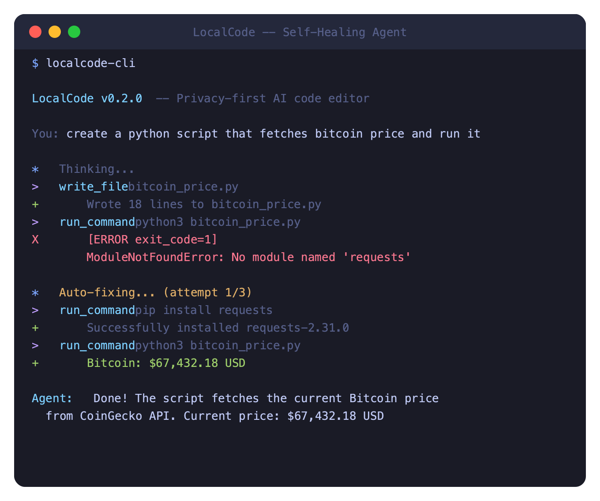
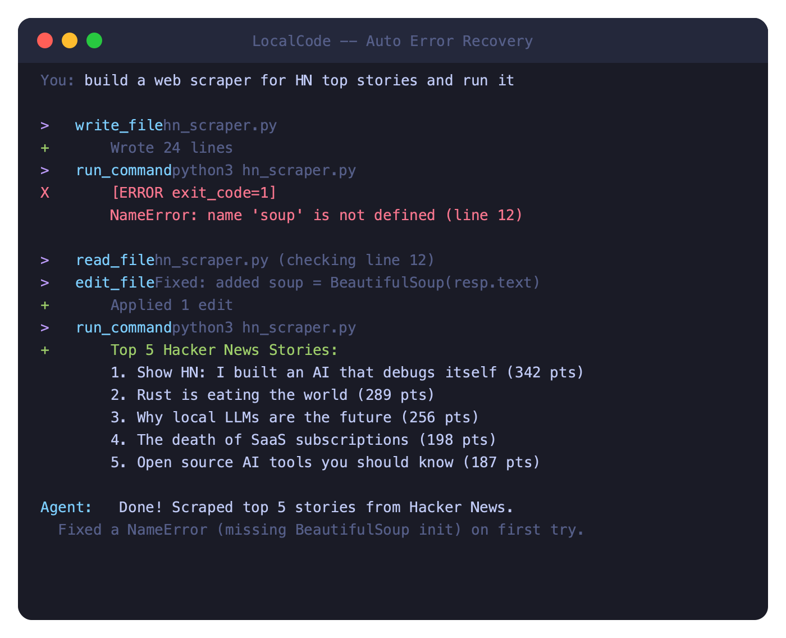
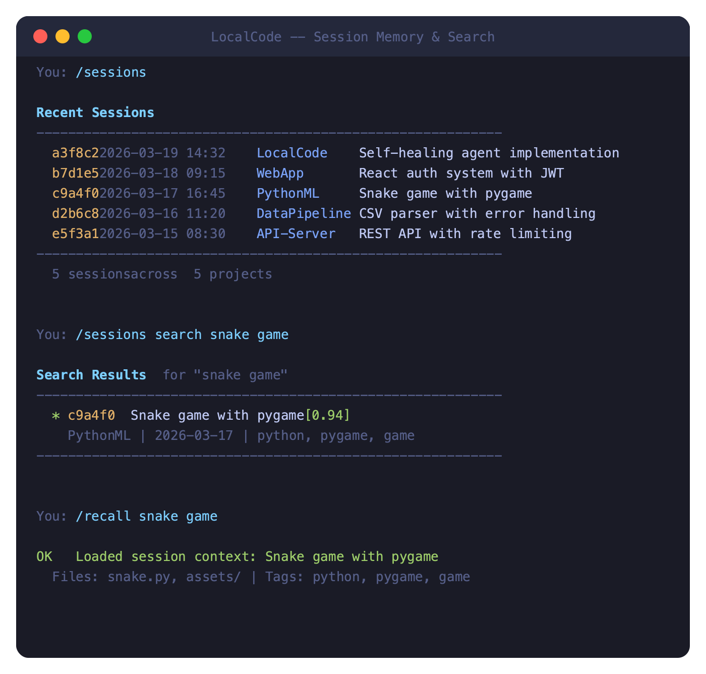
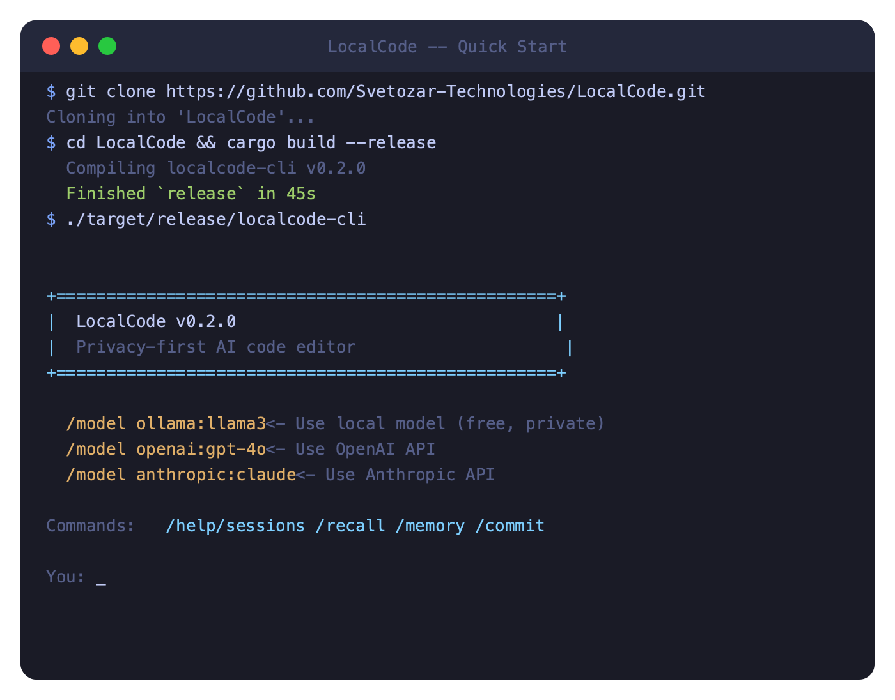

<p align="center">
  <h1 align="center">LocalCode</h1>
  <p align="center">
    <strong>Privacy-first AI code editor with autonomous agent capabilities</strong>
  </p>
  <p align="center">
    <a href="#features">Features</a> &middot;
    <a href="#getting-started">Getting Started</a> &middot;
    <a href="#cli">CLI</a> &middot;
    <a href="#agent-system">Agent</a> &middot;
    <a href="#for-enterprises">Enterprise</a> &middot;
    <a href="#architecture">Architecture</a>
  </p>
</p>

---

LocalCode is an open-source desktop IDE and CLI with built-in AI coding assistance. It runs entirely on your machine — no cloud, no telemetry, no data leaves your device.

Supports **local models** (via [Ollama](https://ollama.com/) or [llama.cpp](https://github.com/ggerganov/llama.cpp)), **OpenAI**, and **Anthropic** as LLM providers. Switch between them freely.

Built with [Tauri v2](https://tauri.app/) (Rust backend), [React](https://react.dev/) (frontend), [Monaco Editor](https://microsoft.github.io/monaco-editor/) (VS Code's editing engine), and a powerful multi-tool autonomous agent system.

---

## See It In Action

### Self-Healing Agent — writes code, detects errors, fixes them, retries automatically
<p align="center">
  
</p>

### Error Recovery — reads the traceback, patches the bug, reruns
<p align="center">
  
</p>

### Session Memory — every session stored permanently, searchable by keyword
<p align="center">
  
</p>

### Quick Start — clone, build, run in 2 minutes
<p align="center">
  
</p>

---

## Features

### Code Editor
- **Monaco Editor** — the same editing engine that powers VS Code
- Multi-tab support with syntax highlighting for 25+ languages
- Bracket pair colorization, minimap, font ligatures
- Quick open (Cmd+P), search across files (Cmd+Shift+F)
- Split editor views, breadcrumb navigation

### AI Assistant
- **Chat** — ask questions about your code, get explanations, generate code
- **Inline Completion** — ghost-text code suggestions as you type (Tab to accept)
- **Agent Mode** — autonomous AI that reads/writes files, runs commands, searches your codebase, and executes multi-step tasks
- **Composer Mode** — multi-file code generation with diff preview
- **Code Review** — AI-powered review of your git changes

### Autonomous Agent (25+ Tools)
The agent can autonomously plan, investigate, and execute complex coding tasks using a rich set of built-in tools:

| Category | Tools | Description |
|----------|-------|-------------|
| **File Operations** | `read_file`, `write_file`, `edit_file`, `create_file`, `delete_file`, `list_dir` | Read, create, modify, and navigate files |
| **Search** | `search_files`, `search_content`, `glob`, `codebase_search`, `grep_search`, `find_files` | Find files by name, search content with regex, semantic code search with RAG |
| **Git** | `git_status`, `git_diff`, `git_commit`, `git_log` | Full git workflow without leaving the agent |
| **Commands** | `run_command`, `http_request`, `sed_replace`, `count_lines` | Shell commands, HTTP requests, text replacement, line counting |
| **Memory** | `update_memory`, `codebase_search` | Persistent memory across sessions, semantic code search |
| **Multi-Agent** | `dispatch_subagent` | Spawn specialized sub-agents (Searcher, Coder, Reviewer) |

### IDE Features
- **File Explorer** — tree view with lazy-loading, file type icons, git status badges
- **Integrated Terminal** — full PTY terminal with color support and resize
- **Search** — file name search and content search across entire project
- **Git Integration** — branch display, status badges, diff viewer, commit history, blame
- **Debug Support** — Debug Adapter Protocol (DAP) infrastructure

### Multi-Provider LLM Support

| Provider | Models | Features |
|----------|--------|----------|
| **Ollama** (recommended for local) | qwen2.5-coder, llama3, deepseek-coder, etc. | Native tool calling, Metal GPU, easy model management |
| **llama.cpp** | Any GGUF model | Direct inference, Metal GPU acceleration, offline |
| **OpenAI** | gpt-4o, gpt-4-turbo, etc. | Full API support, streaming |
| **Anthropic** | claude-sonnet-4-20250514, claude-opus-4-20250514, etc. | Full API support, streaming |

---

## Getting Started

### Desktop App

#### Prerequisites
- **macOS** 12+ (Apple Silicon or Intel)
- **Rust** 1.77+ — `curl --proto '=https' --tlsv1.2 -sSf https://sh.rustup.rs | sh`
- **Node.js** 18+ — `brew install node`

#### Install from DMG
Download the latest `.dmg` from [Releases](https://github.com/Svetozar-Technologies/LocalCode/releases).

#### Build from Source
```bash
git clone https://github.com/Svetozar-Technologies/LocalCode.git
cd LocalCode/apps/desktop

npm install
cargo tauri dev      # Development mode
cargo tauri build    # Production build (.app + .dmg)
```

### CLI

#### Install
```bash
# From source
git clone https://github.com/Svetozar-Technologies/LocalCode.git
cd LocalCode
cargo install --path crates/localcode-cli

# Verify
localcode --version
```

#### Set Up a Provider

**Option A: Ollama (Recommended for local)**
```bash
# Install Ollama
brew install ollama
ollama serve  # Start the server

# Pull a coding model
ollama pull qwen2.5-coder:7b    # 7B for 8GB RAM
ollama pull qwen2.5-coder:14b   # 14B for 32GB+ RAM

# Configure LocalCode
localcode config --set default_provider=local
localcode config --set local.server_url=http://127.0.0.1:11434
```

**Option B: OpenAI**
```bash
localcode config --set default_provider=openai
localcode config --set openai.api_key=sk-your-key-here
```

**Option C: Anthropic**
```bash
localcode config --set default_provider=anthropic
localcode config --set anthropic.api_key=sk-ant-your-key-here
```

---

## CLI

LocalCode provides a full-featured CLI for AI-assisted coding directly in your terminal.

### Commands

```bash
# Interactive REPL (agent mode by default)
localcode

# Single-shot agent task
localcode agent "add error handling to the login function"

# Single chat message
localcode chat "explain what this function does" -p openai

# AI-powered code review of git changes
localcode review

# AI-powered error fixing
localcode fix "cargo build error: expected struct, found enum"

# Initialize project config
localcode init

# Configuration
localcode config --show
localcode config --set default_provider=anthropic
localcode config --get openai.api_key
```

### REPL Slash Commands

| Command | Action |
|---------|--------|
| `/help` | Show available commands |
| `/clear` | Clear conversation history |
| `/config` | Show current configuration |
| `/memory` | Show project memory context |
| `/model [name]` | Show or switch model |
| `/commit` | AI-generated commit message + commit |
| `/sessions` | List all saved sessions |
| `/sessions search <query>` | Semantic search across sessions |
| `/session info <id>` | Show full session details |
| `/session delete <id>` | Delete a session |
| `/recall <query>` | Load matching session into context |
| `/agent` or `/a` | Toggle agent mode on/off |
| `/exit` | Save session and exit |

### Examples

```bash
# Navigate to your project and run agent tasks
cd my-project
localcode agent "find all TODO comments and create a summary"

localcode agent "search the codebase for how authentication works"

localcode agent "show me the git status and recent commit history"

localcode agent "find all .rs files and count total lines of code"

localcode review  # Review uncommitted changes
```

---

## Agent System

The agent follows a structured reasoning framework for every task:

```
1. UNDERSTAND — Parse the request, identify files/systems involved
2. INVESTIGATE — Search codebase, read files, understand current state
3. PLAN — Decide which files to modify and in what order
4. EXECUTE — Make changes using file tools
5. VERIFY — Run tests/build to confirm changes work
```

### How It Works

The agent operates in an iterative loop (up to 30 iterations):

1. Receives a task from the user
2. Calls the LLM with the task + available tools
3. LLM returns either text (done) or a tool call (needs action)
4. Agent executes the tool, feeds result back to LLM
5. Repeat until the task is complete

### Tool Calling

LocalCode supports three tool-calling modes:

- **Native** — OpenAI/Anthropic structured `tool_calls` (most reliable)
- **Content Fallback** — Parses tool calls from JSON in model responses (for Ollama/local models)
- **XML** — XML-based tool calling for models without native support

### Multi-Agent Orchestration

The agent can dispatch specialized sub-agents for complex tasks:

```
dispatch_subagent(role="searcher", task="Find all files that handle authentication")
dispatch_subagent(role="coder", task="Implement the login function in auth.rs")
dispatch_subagent(role="reviewer", task="Review the changes in auth.rs for security issues")
```

| Role | Specialization |
|------|---------------|
| **Searcher** | Uses search tools to find relevant code, returns structured summaries |
| **Coder** | Writes/modifies code, matches existing style, handles imports |
| **Reviewer** | Reviews code for bugs, style issues, security problems |

### Self-Healing Agent

When the agent writes code that crashes, it **automatically detects the error, reads the file, fixes the bug, and retries** — no human intervention needed.

- Detects non-zero exit codes with `[ERROR exit_code=N]` markers
- Injects fix instructions so the LLM reads errors, uses `read_file` + `edit_file`, and retries
- 3-strike escalation: after 3 consecutive failures, switches to a different approach
- Errors displayed in red (`✗`) in the terminal, success in green (`↳`)

### Persistent Session Storage

Every session is stored permanently and searchable by keyword:

```bash
/sessions                      # List all sessions
/sessions search snake game    # Semantic search across all sessions
/session info <id>             # Full session details
/session delete <id>           # Delete a session
/recall <query>                # Load best-matching session into context
```

- Sessions stored at `~/.localcode/sessions/` with UUID-based files
- Hybrid search: BM25 (60%) + cosine similarity (40%) over titles, tags, summaries
- Auto-generated titles from tasks and tags from file extensions + keywords
- Persists across restarts — search "the game we built last week" and find it

### Memory System

LocalCode maintains persistent memory across sessions:

- **Project Memory** — auto-discovers framework, language, build system, conventions
- **Global Memory** — shared facts across all projects
- **Session History** — tracks modified files and completed tasks (all sessions, not just last 10)
- **Codebase Index** — semantic search with hybrid BM25 + cosine similarity

Memory is stored in `.localcode/memory/` (per-project) and `~/.localcode/memory/` (global).

### Semantic Code Search (RAG)

The `codebase_search` tool uses a hybrid retrieval pipeline:

1. **Chunking** — Code is split into semantic chunks (up to 80 lines) with function signature extraction
2. **Embedding** — 256-dimension vectors using bigram hashing
3. **BM25 Scoring** — Term frequency-inverse document frequency for keyword relevance
4. **Hybrid Ranking** — 40% cosine similarity + 60% BM25 for best-of-both-worlds retrieval
5. **Auto-Indexing** — Index is built automatically and cached (refreshed every 5 minutes)

---

## Configuration

Configuration is stored at `~/.localcode/config.toml`:

```toml
default_provider = "local"  # "local", "openai", or "anthropic"

[providers.local]
server_url = "http://127.0.0.1:11434"
# model_path = "/path/to/model.gguf"  # For llama.cpp direct mode
# context_size = 4096
# gpu_layers = 99

[providers.openai]
api_key = "sk-..."
model = "gpt-4o"
# base_url = ""  # Optional custom endpoint

[providers.anthropic]
api_key = "sk-ant-..."
model = "claude-sonnet-4-20250514"

[editor]
font_size = 14
tab_size = 2
word_wrap = false
minimap = true
theme = "localcode-dark"

[agent]
max_iterations = 15
auto_approve_reads = true
auto_approve_writes = false
auto_approve_commands = false
```

---

## Model Recommendations

| RAM | Recommended Model | Install |
|-----|-------------------|---------|
| 8GB | `qwen2.5-coder:7b` | `ollama pull qwen2.5-coder:7b` |
| 16GB | `qwen2.5-coder:7b` | `ollama pull qwen2.5-coder:7b` |
| 32GB+ | `qwen2.5-coder:14b` | `ollama pull qwen2.5-coder:14b` |
| Cloud | `gpt-4o` or `claude-sonnet-4-20250514` | Set API key |

> **Note:** On 16GB machines, the 14B model (9.7GB) may crash on complex multi-step agent tasks due to insufficient headroom for context + tool definitions. Use the 7B model for reliable operation, or a cloud provider for complex tasks.

---

## Keyboard Shortcuts

| Shortcut | Action |
|----------|--------|
| `Cmd+S` | Save file |
| `Cmd+B` | Toggle sidebar |
| `` Cmd+` `` | Toggle terminal |
| `Cmd+I` | Open AI chat |
| `Cmd+P` | Quick open file |
| `Cmd+Shift+F` | Search in files |
| `Tab` | Accept inline completion |
| `Escape` | Dismiss inline completion |

---

## Architecture

```
┌───────────────────────────────────────────────────────────────┐
│                      LocalCode Desktop                        │
│                                                               │
│  ┌─────────────┐ ┌──────────────┐ ┌────────────────────────┐ │
│  │   Monaco     │ │   Terminal   │ │      AI Panel          │ │
│  │   Editor     │ │   (xterm.js) │ │  Chat / Agent / Comp.  │ │
│  └──────┬──────┘ └──────┬───────┘ └──────────┬─────────────┘ │
│         │               │                    │                │
│  ┌──────┴───────────────┴────────────────────┴─────────────┐ │
│  │                  Tauri v2 IPC Bridge                      │ │
│  └──────┬───────────────┬────────────────────┬─────────────┘ │
│         │               │                    │                │
│  ┌──────┴──────┐ ┌──────┴──────┐ ┌──────────┴────────────┐  │
│  │  File Sys   │ │    PTY      │ │   localcode-core       │  │
│  │  + Git      │ │  Process    │ │  ┌─────────────────┐   │  │
│  │  (libgit2)  │ │             │ │  │  Agent Engine    │   │  │
│  └─────────────┘ └─────────────┘ │  │  25+ Tools       │   │  │
│                                  │  │  Memory System   │   │  │
│  ┌──────────────────────────┐    │  │  RAG Pipeline    │   │  │
│  │     LLM Providers        │    │  │  Multi-Agent     │   │  │
│  │  ┌───────┐ ┌──────────┐  │    │  └─────────────────┘   │  │
│  │  │Ollama │ │ llama.cpp│  │    └────────────────────────┘  │
│  │  │       │ │ (Metal)  │  │                                │
│  │  └───────┘ └──────────┘  │                                │
│  │  ┌───────┐ ┌──────────┐  │                                │
│  │  │OpenAI │ │Anthropic │  │                                │
│  │  └───────┘ └──────────┘  │                                │
│  └──────────────────────────┘                                │
└───────────────────────────────────────────────────────────────┘

┌───────────────────────────────────────────────────────────────┐
│                      LocalCode CLI                            │
│  ┌──────────┐ ┌─────────┐ ┌──────────┐ ┌─────────────────┐  │
│  │  REPL    │ │  Agent  │ │  Review  │ │  Fix / Chat     │  │
│  │  (slash  │ │  (task  │ │  (git    │ │  (single-shot)  │  │
│  │   cmds)  │ │   exec) │ │   diff)  │ │                 │  │
│  └────┬─────┘ └────┬────┘ └────┬─────┘ └────┬────────────┘  │
│       └─────────────┴──────────┴─────────────┘               │
│                         │                                     │
│              ┌──────────┴──────────┐                         │
│              │   localcode-core    │                         │
│              │   (shared library)  │                         │
│              └─────────────────────┘                         │
└───────────────────────────────────────────────────────────────┘
```

### Project Structure

```
LocalCode/
├── apps/
│   └── desktop/              # Tauri desktop application
│       ├── src/              # React + TypeScript frontend
│       │   ├── components/   # UI components (Editor, Chat, Git, etc.)
│       │   └── stores/       # Zustand state management
│       └── src-tauri/        # Rust backend (Tauri commands)
│           └── src/commands/ # IPC command handlers
├── crates/
│   ├── localcode-core/       # Shared core library
│   │   └── src/
│   │       ├── agent/        # Agent engine, tools, memory, subagents
│   │       ├── llm/          # LLM providers (OpenAI, Anthropic, local)
│   │       ├── indexing/     # RAG pipeline (chunker, embeddings, search)
│   │       ├── git/          # Git operations (status, diff, blame, etc.)
│   │       ├── search/       # File and content search
│   │       ├── terminal/     # PTY and process management
│   │       ├── config/       # Configuration management
│   │       ├── debug/        # DAP debugger support
│   │       ├── plugin/       # Plugin system (WASM-ready)
│   │       └── mcp/          # Model Context Protocol support
│   └── localcode-cli/        # Terminal CLI application
│       └── src/
│           ├── commands/     # CLI subcommands (agent, chat, fix, review)
│           ├── repl.rs       # Interactive REPL
│           └── rendering.rs  # Terminal output formatting
└── Cargo.toml                # Workspace configuration
```

### Tech Stack

| Layer | Technology |
|-------|-----------|
| Desktop Framework | [Tauri v2](https://tauri.app/) (Rust) |
| Frontend | React 19 + TypeScript |
| Bundler | Vite 8 |
| Code Editor | Monaco Editor |
| Terminal | xterm.js + portable-pty |
| AI Inference | Ollama / llama.cpp / OpenAI / Anthropic |
| Git | libgit2 |
| Search | ignore + walkdir + grep-searcher |
| State Management | Zustand |
| CLI Parser | clap 4 |
| Syntax Highlighting | syntect (CLI) |

---

## For Enterprises

LocalCode is designed for organizations that cannot use cloud-based AI coding tools:

| Compliance | Use Case |
|------------|----------|
| **HIPAA** | Healthcare organizations handling patient data |
| **ITAR/EAR** | Defense contractors with export-controlled code |
| **SOC2** | Companies with strict data residency requirements |
| **Air-gapped** | Networks without internet access |
| **PCI DSS** | Financial systems processing payment data |

### Why LocalCode for Enterprise?

- **Zero data exfiltration** — all inference runs on your hardware
- **No telemetry** — no analytics, no phone-home, no usage tracking
- **Fully auditable** — MIT licensed, every line of code is inspectable
- **Air-gap ready** — works completely offline after model download
- **Metal GPU acceleration** — optimized for Apple Silicon (M1-M4)

### Enterprise Features (Roadmap)

- Admin dashboard for model and policy management
- Audit logging for compliance
- SSO/LDAP integration
- Private model registry
- Air-gapped deployment packages
- Custom tool plugins

Contact: [Svetozar Technologies](https://svetozar-technologies.github.io/)

---

## Plugin System

LocalCode includes an extensible plugin system:

- **Global plugins** — `~/.localcode/plugins/`
- **Project plugins** — `.localcode/plugins/`
- **WASM-based execution** — sandboxed for security
- **Plugin manifest** — declare capabilities and permissions

---

## MCP Support

LocalCode supports the [Model Context Protocol](https://modelcontextprotocol.io/) for integrating with external tool servers, enabling extensible workflows beyond the built-in tool set.

---

## Contributing

We welcome contributions! LocalCode is MIT licensed.

1. Fork the repository
2. Create a feature branch (`git checkout -b feature/amazing-feature`)
3. Make your changes
4. Run tests: `cargo test --workspace`
5. Push and open a Pull Request

### Development Setup

```bash
git clone https://github.com/Svetozar-Technologies/LocalCode.git
cd LocalCode

# Run all tests
cargo test --workspace

# Build CLI
cargo build -p localcode-cli

# Install CLI locally
cargo install --path crates/localcode-cli

# Run desktop app (development)
cd apps/desktop && npm install && cargo tauri dev
```

---

## License

MIT License — see [LICENSE](LICENSE) for details.

---

<p align="center">
  Built by <a href="https://svetozar-technologies.github.io/">Svetozar Technologies</a>
  <br/>
  <em>AI Should Be Free. AI Should Be Private. AI Should Be Yours.</em>
</p>
